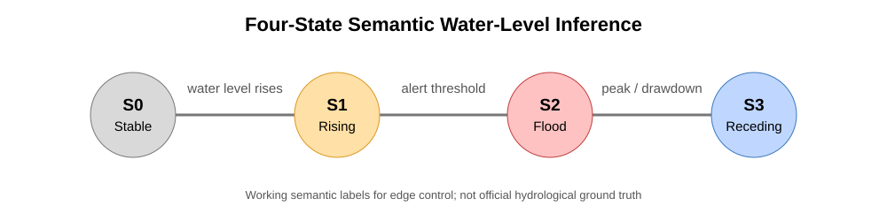

# Lightweight Semantic Water-Level Inference on STM32 for Edge Flood Monitoring

Research repository for **“Lightweight Semantic Water-Level Inference on STM32 for Edge Flood Monitoring”**, accepted for **Oral Presentation at the 2026 IEEE 15th Global Conference on Consumer Electronics (IEEE GCCE 2026)**.

This project studies how a compact and interpretable water-level semantic model can be trained under limited flood-event data and deployed on a resource-constrained MCU.

> **Status:** First author · Accepted for Oral Presentation · IEEE GCCE 2026

## Overview

A minute-level water-level stream is mapped to four operational semantic states:

- **S0 — Stable**
- **S1 — Rising**
- **S2 — Flood**
- **S3 — Receding**

The research focuses on event-aware evaluation, training under scarce flood events, teacher-guided lightweight modeling, and MCU deployment.



## Research pipeline

```text
Water-level stream
        ↓
Cleaning and quality checks
        ↓
Causal four-state working labels
        ↓
Event-aware split
        ↓
Train-side event augmentation
        ↓
CatBoost teacher
        ↓
Teacher-guided compact student
        ↓
Depth-3 Decision Tree
        ↓
C99 export → STM32L476RG
```

### Event-aware evaluation

The cleaned series contains **2,878 minute-level samples**. Rather than randomly splitting adjacent time windows, flood events are kept as units. The complete Event 3 flood cycle is reserved as **unseen real-only evaluation data** and is not used for training, augmentation, or parameter tuning.

### Train-side augmentation

The training side contains only smaller real events and very limited S2 flood samples. Event-level synthetic sequences are therefore used only on the training side. Final evaluation remains entirely real.

### Teacher-guided compact student

A CatBoost model serves as the high-capacity teacher. The selected student is a **depth-3 Decision Tree** with **15 nodes and 8 leaves**. Teacher hard predictions are used as training targets and teacher confidence is used as a sample weight. This repository describes the procedure as **teacher-guided confidence-weighted supervision**, not standard KL-divergence soft-label knowledge distillation.

## Key results

| Model / deployment item | Result |
|---|---:|
| CatBoost teacher — full-cycle Event 3 Macro-F1 | **0.9001** |
| Depth-3 student — full-cycle Event 3 Macro-F1 | **0.8588** |
| Student S1 recall | **0.9364** |
| Student S2 recall | **0.5441** |
| Student S3 recall | **0.8930** |
| Student depth / nodes / leaves | **3 / 15 / 8** |
| Frozen student model size | **3.149 KB** |
| STM32L476RG average inference latency | **≈ 79 μs** |
| PC–MCU implementation agreement | **100%** |

The **100% PC–MCU agreement** measures implementation equivalence during replay of the cleaned stream; it is **not classification accuracy**.

## Implementation

The research workflow is primarily implemented in **Python** for data preparation, feature engineering, teacher/student training, evaluation, and artifact generation. The selected decision-tree student is exported to **C99** for resource-constrained deployment on the **STM32L476RG**.

A compact C reference implementation corresponding to the frozen depth-3 tree is included under [`deployment/`](deployment/). It is reconstructed directly from the frozen tree rules for transparency; the complete original STM32Cube firmware project was not included in the uploaded research bundle used to curate this repository.

## Repository structure

```text
.
├── README.md
├── requirements.txt
├── src/                     # Python research pipeline
├── data/
│   └── summaries/           # data quality / event / state / training summaries
├── artifacts/
│   ├── figures/             # semantic-state overview
│   ├── teacher/             # teacher metrics and leakage evidence
│   └── student/             # final student metrics, rules, features, trade-offs
├── docs/
│   └── experiment_protocol.md
└── deployment/
    ├── model_inference.c    # C99 reference implementation of the frozen tree
    ├── model_inference.h    # C99 interface and state definitions
    └── README.md            # STM32 deployment notes
```

## Code map

The original experiment files had stage-oriented names. They are renamed here to make the workflow easier to follow:

1. `01_prepare_water_level_data.py`
2. `02_build_semantic_fsm_labels.py`
3. `03_build_causal_features.py`
4. `04_select_balanced_synthetic_events.py`
5. `05_freeze_catboost_teacher.py`
6. `06_finalize_teacher_selection.py`
7. `07_define_student_protocol.py`
8. `08_train_student_candidates.py`
9. `09_audit_student_candidates.py`
10. `10_freeze_final_student.py`

These files are curated research snapshots rather than a one-click reproduction package; several intermediate experiment artifacts from the original workspace are intentionally omitted.

## Representative artifacts

- [`data/summaries/event_summary.csv`](data/summaries/event_summary.csv) — Events 1–3 and the held-out complete flood event.
- [`data/summaries/training_composition.csv`](data/summaries/training_composition.csv) — real versus synthetic training composition.
- [`artifacts/teacher/evaluation_metrics.csv`](artifacts/teacher/evaluation_metrics.csv) — selected teacher evaluation metrics.
- [`artifacts/teacher/leakage_audit.csv`](artifacts/teacher/leakage_audit.csv) — leakage-control evidence.
- [`artifacts/student/final_metrics.csv`](artifacts/student/final_metrics.csv) — selected depth-3 student metrics.
- [`artifacts/student/feature_spec.csv`](artifacts/student/feature_spec.csv) — 17 causal, edge-computable student features.
- [`artifacts/student/tree_rules.txt`](artifacts/student/tree_rules.txt) — interpretable depth-3 tree rules.
- [`deployment/model_inference.c`](deployment/model_inference.c) — C99 reference implementation of the frozen student.
- [`docs/experiment_protocol.md`](docs/experiment_protocol.md) — split, leakage, and teacher/student protocol.

## Limitations

Evaluation currently relies on **one held-out complete flood event**. The depth-3 student also trades some flood-state sensitivity for better receding-state stability; S2 recall remains limited. These results support compact deployment feasibility in this case study, but do not establish generalization across all flood events or sensing domains.

## Relationship to the undergraduate capstone

This research extends the AI water-level semantic inference component of the broader undergraduate capstone on VoI-driven adaptive LoRa/Wi-Fi flood monitoring. The GCCE study narrows the scope to model evaluation, lightweight student selection, and MCU deployment.

## Conference

**2026 IEEE 15th Global Conference on Consumer Electronics (IEEE GCCE 2026)**  
Kobe, Japan · October 26–29, 2026  
**First author · Accepted for Oral Presentation**

---

This repository is a curated research archive for documentation and portfolio review. The original research workspace contains additional intermediate experiment files and board-integration assets that are not all included here.
